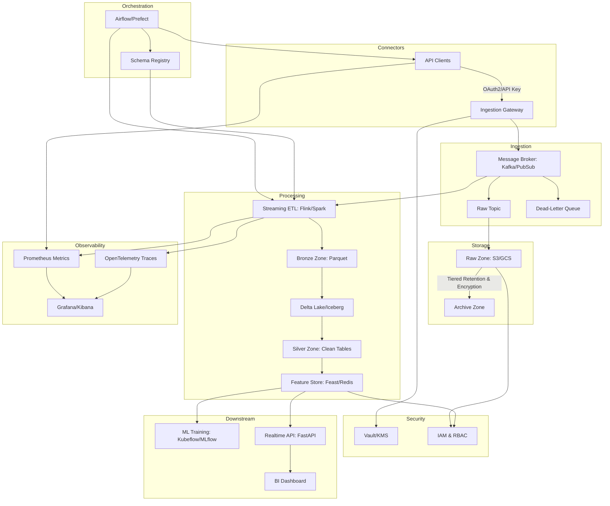

# 📊 DIP: Data Ingestion Pipeline

**DIP** (Data Ingestion Pipeline) is a modular, scalable system designed to collect, process, and deliver social media analytics to downstream machine-learning services. Although its first use case targets TikTok and Instagram metrics for abaya-seller content optimization, its architecture is adaptable to any streaming or batch data source.

---

## 🔍 Overview

DIP automates the end-to-end flow:

1. **Data Connectors** fetch raw metrics from APIs
2. **Data Lake** persists raw, unmodified payloads for audit and replay
3. **Processing & Feature Store** normalizes, enriches, and stores cleaned data
4. **Orchestration & Scheduling** ensures reliability, retries, and lineage
5. **Monitoring & Alerting** tracks health, latency, and data quality

This workflow guarantees fresh, accurate inputs for any ML or analytics consumer.

---

## 🏗 Architecture

Key highlights:

Ingestion Gateway handles authentication, backpressure, and integrates with the DLQ for poison messages.

Message Broker with DLQ ensures at-least-once delivery and dead-lettering problematic records automatically.

Multi-zone Storage (Raw ▶ Bronze ▶ Silver) supports schema evolution, data validation, partition pruning, and encrypted retention policies.

Streaming ETL maintains event-time processing, watermarks, and exactly-once semantics, with side outputs for error handling.

Feature Store separates high-throughput online serving (Redis) from bulk offline retrieval (BigQuery/Snowflake).

Orchestration & Governance automates retries, tracks lineage, and ensures schema compatibility via the registry.

Observability provides end-to-end metrics, traces, and log correlation for rapid incident response.

Security enforces encryption-at-rest/in-transit, centralized secret management, and fine-grained access controls.

⚙️ Workflow Steps

Connect & Authenticate

Initialize connector with credentials from Vault/KMS.

Validate connectivity and check API quotas.

Fetch & Stream

Pull paginated data in scheduled jobs or continuous streams.

Publish each batch/message to the raw ingest topic in Kafka_PubSub.

Validate & Persist Raw

Consumer writes raw JSON to object storage, partitioned by source/date.

Poison messages routed to a Dead-Letter Queue for manual inspection.

Streaming ETL

Deserialize messages, apply schema validation from the registry.

Transform timestamps, compute derived fields (e.g., engagement_ratio).

Emit cleaned records to Bronze Zone and archival sinks.

Batch/Historical Processing

Run nightly Spark jobs for backfills or reprocess historical data.

Feature Engineering

Aggregate time windows (hourly/daily), vectorize text (captions, hashtags).

Store feature tables in Feature Store with versioning.

Consume & Serve

ML jobs pull offline features for model training.

Real-time API queries online features to score new posts on demand.

Monitoring & Alerting

Track connector latencies, ETL processing times, and data freshness SLAs with Prometheus.

Alert on errors, high DLQ rates, or schema mismatches via Grafana/Kibana.

Feedback Loop

Log predictions and real engagement metrics back into the pipeline for retraining.

Enable A/B testing workflows by tagging traffic in inference endpoints.

Connect• Authenticate and fetch metrics (e.g. post views, likes, comments, audience demographics) via TikTok/Instagram APIs.

Persist• Write raw payloads to object storage, partitioned by date and source.

Process• Schedule ETL jobs to normalize timestamps, extract hashtags, compute engagement ratios, and handle missing fields.• Store enriched records in a low‑latency feature store for consumption.

Serve & Consume• Expose feature endpoints via microservice for both batch re‑training and real‑time scoring.

Monitor• Track connector success rates, ETL durations, and data freshness.• Trigger alerts on failures or SLA breaches.

📁 Components

Connectors: Python clients for each social API, with pagination and rate‑limit handling.

Data Lake: Immutable raw store for audit and replay scenarios.

ETL Workers: Kafka‑driven or batch Spark jobs transforming raw to structured.

Feature Store: Redis for real‑time, Apache Hudi for batch serving.

Orchestrator: Airflow or Prefect DAGs managing dependencies and retries.

Monitoring: Prometheus exporters and Grafana dashboards.

Microservices: FastAPI endpoints delivering features to ML and BI layers.

📈 Adaptability & Scaling

Pluggable Connectors: Add new APIs by implementing a standard interface.

Storage Agnostic: Swap S3 for GCS or HDFS with minimal config.

Auto‑Scaling: Containerized workers scale on message queue depth or batch backlog.
